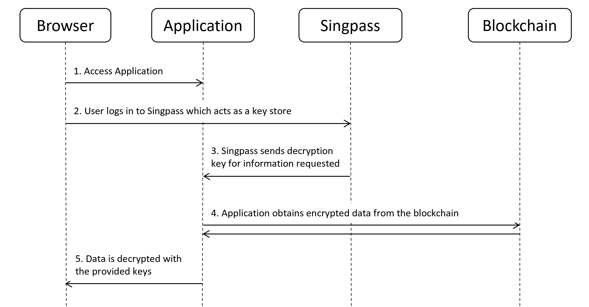

# It'z Me

## About the Project

(This project is developed as part of GovTech's Stack The Codes 2022 Hackathon)

It'z Me is a permissioned blockchain used to store digital identities. The concept of It'z Me is developed with the intention to integrate together with Singapore's existing National Digital Identity, [Singpass](https://www.singpass.gov.sg/main/singpass-our-ndi). As it stands, Singpass is a centralized ID provider. In the event that it is made unavailable and rendered non-recoverable, it will no longer be able to perform trust attestation or authentication of users and devices. 

The solution is to adopt a decentralized model of doing trust attestation using a blockchain. However, we recognize that there are many benefits of having a central authority. The It'z Me permissioned blockchain aims to preserve the benefits of both methods. 

## Repository Structure

In this repository, you will find 3 folders. 

1. [`blockchain`](blockchain/)

This folder contains the code to deploy blockchain nodes, as well as an API to perform several functions on the chain. 

2. [`mobile-app`](mobile-app/)

This folder contians a mobile application meant to mimic the functionality of the Singpass app. It's purpose is to demonstrate the new authentication flow with the implementation of the blockchain. 

3. [`web-demo`](web-demo/)

This folder contains the code to deploy a web application that serves 2 purposes. Firstly, it contains a graphical interface for the API in `blockchain`. Secondly, it attempts to simulate how a third-party application would authenticate it's users via the blockchain and the mobile application. 

## How it works?

For more detailed explanation, look into the individual application folders. 

### Permissioned blockchain

Public blockchains allow anyone to access them. They are built with the assumption of zero-trust of individual actors. Private blockchains on the other hand are completely closed off. Participants are all known to each other. Permissioned blockchains on the other hand are a hybrid of public and private blockchains. 

It'z Me is built with the assumption of trust for a handful of participants in the chain. These trusted individuals have write access to the blockchain. They are the authorities issuing identities to users. In other words, they are, in most cases, large government organizations. 

Issuers are the entities who are creating identities for users. The Genesis block of the blockchain will create the first "issuer". The Genesis Issuer would have the authority to not only issue identities but also create new issuers. Although issuers are assumed to be trusted, they need not be granted the authority to further create issuers. 

### Storage of Identities

The blockchain replaces the MyInfo resource server, enabling decentralized storage of information. Unlike more popular blockchains like Bitcoin and Ethereum, each block only contains a single transaction. Since all writers to the blockchain are trusted, there is no need for a PoW or PoS function to hinder write access. Since the data being stored is sensitive, the data stored on the blockchain is first encrypted. This means that to retrieve an identity stored on the chain, one would need 2 pieces of information, the decryption key, and the block location. 

### Authentication Flow

Form the Singpass [Documentation](https://api.singpass.gov.sg/library/myinfo/developers/overview) for developers, the following shows a logical overview of the architecture.

From the above, we can understand the various services in play in every authentication procedure. Additionallly, Singpass provides us with an auth sequence diagram. 

The services that we aim to decentralize are the MyInfo server and the Service Authorization API. The centralization of services around Singpass is a desirable trait that promotes ease of use. Since this is a National Identity system, accessibility and usability is a key consideration to ensure the less tech-savy can still take full advantage of the application features. 

With this in mind, the new authorization flow is as follows. 

### Singpass as a central authority

As mentioned previously, an issue with having a central ID provider is that the entire system is susceptible to a single failure point. However, this is not necessarily the case with Singpass. As mentioned in the Authentication Flow diagram, Singpass would act as a keystore. By caching the keys on the user device, we can maintain some level of functionality even if the central Singpass server were to fail. 

The current version of the Singpass app allows users to log into the app and view their digital identification cards without having an internet connection. This means that at its current state, it is already caching information for quick access. All of these is protected locally via biometric authentication. 

However, there is still impact to the current model if the central Singpass server were to go down. Namely, users would not be able to receive new keys. The event of issuing new keys which is likened to issuing of a new identity card is a less common and non-time critical event. Therefore, since the proposed authentication method with Singpass does not rely on the central server, the impact of failure is minimized. 

